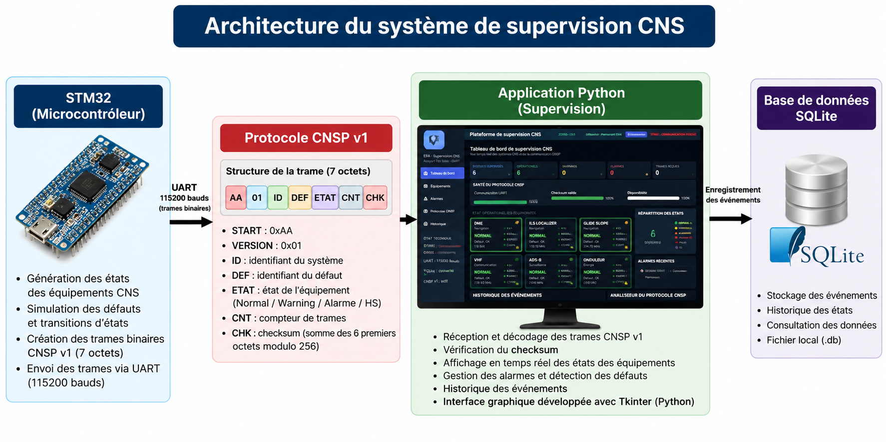
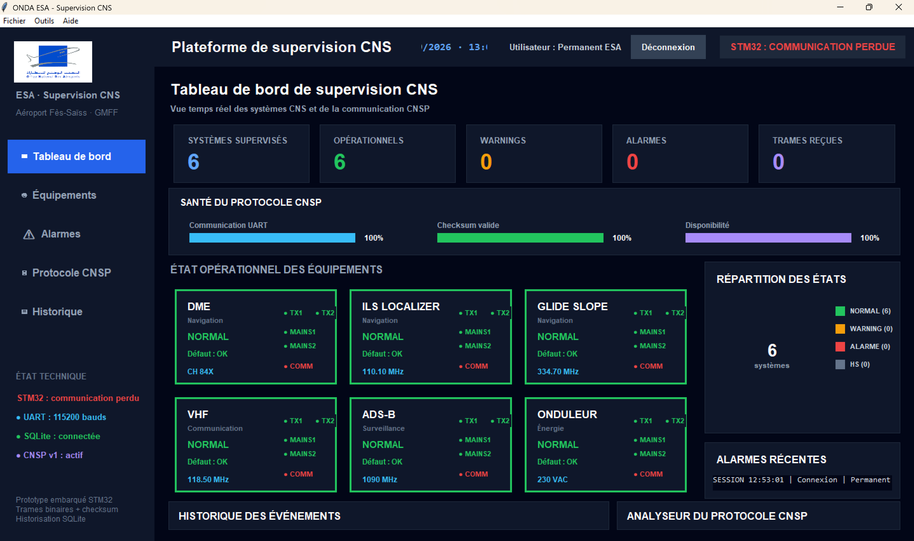

# ✈️ Centralized CNS Systems Supervision

Prototype of a centralized supervision system for CNS equipment, developed during an internship at **ONDA – Fès-Saïss Airport**.

The project combines an **STM32 microcontroller**, a custom binary communication protocol and a **Python supervision application**.

> This repository presents an academic engineering prototype based on representative logical equipment states.  
> It does not contain operational airport data.

---

## 🏗️ System Architecture

The prototype is based on communication between an STM32 embedded system and a Python supervision application.

The STM32 generates representative CNS equipment states and transmits them through UART using the **CNSP v1 binary protocol**.

The Python application receives and decodes the frames, updates the supervision interface and stores events in a local SQLite database.



---

## 🖥️ Supervision Dashboard

The Python application provides:

- real-time visualization of CNS equipment states;
- UART communication monitoring;
- CNSP frame decoding;
- checksum verification;
- warning and alarm visualization;
- communication-loss detection;
- event history;
- local SQLite data storage.

> The screenshot below was taken without the STM32 board connected, which explains the communication loss indicator displayed by the application.



---

## 🎯 Project Objective

The objective of this project was to develop a prototype capable of:

- supervising several CNS-related systems from a centralized interface;
- transmitting equipment states and faults from an STM32 to a computer;
- structuring communication using binary frames;
- validating and decoding received frames;
- displaying equipment states in real time;
- identifying faults, warnings and alarms;
- storing supervision events in a local database.

---

## 📡 Supervised Systems

The prototype represents six systems:

| System | Function |
|---|---|
| DME | Navigation |
| ILS Localizer | Navigation |
| Glide Slope | Navigation |
| VHF | Communication |
| ADS-B | Surveillance |
| UPS | Power support |

The possible operating states are:

- 🟢 **NORMAL**
- 🟠 **WARNING**
- 🔴 **ALARM**
- ⚫ **OUT OF SERVICE**

For standard CNS faults, the embedded logic first generates a **WARNING** state.

If the fault persists for **5 seconds**, the system changes to **ALARM**.

A power-supply loss can directly place the affected equipment in the **OUT OF SERVICE** state.

---

## 🔐 CNSP v1 Binary Protocol

A custom binary communication protocol called **CNSP v1** was implemented between the STM32 and the supervision application.

Each frame contains **7 bytes**:

```text
START | VERSION | ADDRESS | FAULT | STATE | COUNTER | CHECKSUM
